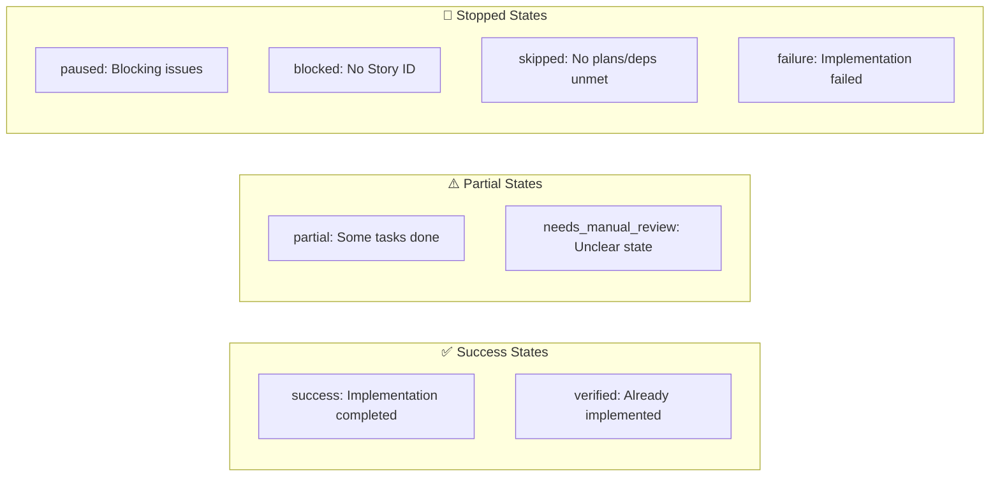

# Implement Story Workflow

> **Purpose:** Automatically implement TDD implementation plans via CI, managing the full lifecycle from plan selection through implementation and archival.

## Workflow Overview

```mermaid
flowchart TD
    subgraph TRIGGER["⏰ Trigger"]
        T1[Schedule: Every 10 min]
        T2[Manual: workflow_dispatch]
    end

    subgraph SETUP["1️⃣ setup-and-plan"]
        S1[Find plans in ${STORYTREE_DATA_DIR}/plans/]
        S2[Select earliest by sequence NNN_name.md]
        S3[Extract Story ID from plan]
        S4{Story already<br/>implemented?}
        S5{Dependencies<br/>met?}
        S6[Determine eligibility]
    end

    subgraph VALIDATE["2️⃣ validate-plan"]
        V1[Match plan to story in DB]
        V2{Match found?}
        V3[Update plan with Story ID]
        V4[Move to blocked/]
    end

    subgraph VERIFY["3️⃣ verify-implementation"]
        VE1[Check if deliverables exist]
        VE2{Implementation<br/>exists?}
        VE3[Archive plan]
        VE4[Reset story stage]
    end

    subgraph REVIEW["4️⃣ review-plan"]
        R1[Claude reviews plan]
        R2{Outcome?}
    end

    subgraph DECOMPOSE["5️⃣ decompose"]
        D1[Count TDD tasks]
        D2{Complexity?}
        D3[Implement as-is]
        D4[Split into sub-plans]
    end

    subgraph IMPLEMENT["6️⃣ implement"]
        E1[Follow TDD steps]
        E2[RED: Write test]
        E3[GREEN: Implement]
        E4[COMMIT: Save work]
        E5[Push to main]
    end

    subgraph FINALIZE["7️⃣ finalize"]
        F1[Archive implemented plan]
        F2[Update story in DB]
        F3[Post to GitHub issue]
        F4[Generate summary]
    end

    %% Main flow
    T1 & T2 --> S1
    S1 --> S2 --> S3 --> S4

    S4 -->|"Stage: reviewing/verifying"| VERIFY
    S4 -->|"Stage: planned/active"| S5

    S5 -->|No| BLOCKED[Move to blocked/]
    S5 -->|Yes| S6

    S3 -->|"story_id = none"| VALIDATE

    V1 --> V2
    V2 -->|">80% confidence"| V3 --> REVIEW
    V2 -->|"No match"| V4 --> END1[❌ Blocked]

    VE1 --> VE2
    VE2 -->|"Yes"| VE3 --> END2[✅ Verified]
    VE2 -->|"No"| VE4 --> REVIEW

    S6 -->|"should_execute=true"| REVIEW

    R1 --> R2
    R2 -->|"proceed"| DECOMPOSE
    R2 -->|"proceed_with_review"| DECOMPOSE
    R2 -->|"verified"| F1
    R2 -->|"pause"| END3[⏸️ Paused]

    D1 --> D2
    D2 -->|"simple: 1-3 tasks"| D3
    D2 -->|"medium: 4-6 tasks"| D3
    D2 -->|"complex: 7+ tasks"| D4
    D3 & D4 --> IMPLEMENT

    E1 --> E2 --> E3 --> E4
    E4 -->|"More tasks"| E2
    E4 -->|"Done"| E5 --> FINALIZE

    F1 --> F2 --> F3 --> F4 --> END4[✅ Success]

    %% Styling
    classDef trigger fill:#e1f5fe,stroke:#01579b
    classDef job fill:#fff3e0,stroke:#e65100
    classDef decision fill:#fce4ec,stroke:#880e4f
    classDef endpoint fill:#e8f5e9,stroke:#1b5e20
    classDef error fill:#ffebee,stroke:#b71c1c

    class T1,T2 trigger
    class S4,S5,V2,VE2,R2,D2 decision
    class END2,END4 endpoint
    class END1,END3,BLOCKED error
```

## Job Details

### 1️⃣ setup-and-plan

**Purpose:** Find and select the next plan to implement, validate dependencies.

| Step | Action | Output |
|------|--------|--------|
| Find plans | Scan `${STORYTREE_DATA_DIR}/plans/*.md` | `plans_found` |
| Select plan | Choose earliest by sequence (016 < 016A < 017) | `plan_path`, `plan_filename` |
| Extract Story ID | Parse `**Story ID:** X.Y` from plan | `story_id` or `none` |
| Check implemented | Query DB for story stage | `already_implemented`, `current_stage` |
| Check deps | Verify dependency stories are implemented | `deps_met` |
| Determine | Calculate implementation eligibility | `should_implement`, `needs_verification` |

**Decision Matrix:**

| Condition | should_implement | skip_reason | needs_verification |
|-----------|-----------------|-------------|-------------------|
| No plans found | false | no_plans | false |
| Story at reviewing/verifying | false | needs_verification | **true** |
| Dependencies unmet | false | deps_unmet | false |
| Ready to implement | **true** | (empty) | false |

---

### 2️⃣ validate-plan

**Runs when:** `story_id == 'none'` (plan missing Story ID)

**Purpose:** Match plan content to stories in database.

```
Claude (Sonnet) → Reads plan → Queries DB → Finds matching story
                                          ↓
                              >80% confidence? → Update plan with Story ID
                                          ↓
                              No match? → Move plan to blocked/
```

---

### 3️⃣ verify-implementation

**Runs when:** `needs_verification == true` (story at reviewing/verifying but plan still exists)

**Purpose:** Check if implementation already exists in codebase.

| Verification Result | Action |
|---------------------|--------|
| Implementation exists | Archive plan → **verified** |
| Implementation missing | Reset story to `planned` → proceed to implement |
| Partial implementation | Flag for manual review |

---

### 4️⃣ review-plan

**Runs when:** Ready to implement (either directly or after verification)

**Purpose:** Critical review before implementation.

| Outcome | Meaning | Next Step |
|---------|---------|-----------|
| `proceed` | Plan is clear, work not done | → decompose |
| `proceed_with_review` | Minor issues, but implementable | → decompose (flag for review) |
| `verified` | Already implemented | → finalize (archive) |
| `pause` | Blocking issues found | → stop |

---

### 5️⃣ decompose

**Runs when:** `outcome == 'proceed'` or `'proceed_with_review'`

**Purpose:** Assess complexity, split large plans.

**Current Thresholds:**

| Complexity | Task Count | Action |
|------------|------------|--------|
| simple | 1-3 | Implement as-is |
| medium | 4-6 | Implement as-is ⚠️ |
| complex | 7+ | Split into 3-5 task sub-plans |

> ⚠️ **Known Issue:** Medium plans (4-6 tasks) often exceed 50 turns but are not split.

**Intended Behavior (not implemented):**
- All plans should be recursively decomposed until simple (1-2 tasks)
- Medium and complex should both trigger decomposition

---

### 6️⃣ implement

**Runs when:** `implement_plan != ''`

**Purpose:** Follow TDD steps from the plan.

```
For each task in plan:
    1. RED: Write failing test
    2. Verify: pytest → FAIL expected
    3. GREEN: Implement code
    4. Verify: pytest → PASS expected
    5. COMMIT: git commit with message
```

**Configuration:**
- Model: `claude-sonnet-4-5-20250929`
- Max turns: **50**
- Timeout: 45 minutes

**Allowed Tools:**
```
Read, Write, Edit, Glob, Grep,
Bash(git:*), Bash(python:*), Bash(python3:*),
Bash(pytest:*), Bash(pip:*), Bash(pip3:*),
Bash(mkdir:*), BashOutput, TodoWrite
```

> ⚠️ **Known Issues:**
> - 50 turns often insufficient for 4+ task plans
> - Commands not in allowedTools cause permission denials (wasted turns)
> - Windows paths in plans fail on Linux CI runner

---

### 7️⃣ finalize

**Runs:** Always (even on failure)

**Purpose:** Clean up, report results.

| Step | Action |
|------|--------|
| Determine outcome | Aggregate results from all jobs |
| Archive plan | Move to `${STORYTREE_DATA_DIR}/plans/implemented/` |
| Update database | Set story stage (verifying/reviewing/implemented) |
| Post to issue | Comment on GitHub issue with results |
| Generate summary | Write to `$GITHUB_STEP_SUMMARY` |

---

## File Locations

| Purpose | Path |
|---------|------|
| Pending plans | `${STORYTREE_DATA_DIR}/plans/*.md` |
| Implemented plans | `${STORYTREE_DATA_DIR}/plans/implemented/*.md` |
| Blocked plans | `${STORYTREE_DATA_DIR}/plans/blocked/*.md` |
| Story database | `${STORYTREE_DATA_DIR}/story-tree.db` |
| CI result files | `.claude/skills/story-implementation/ci-*.json` |

---

## Final Outcomes



| Outcome | Story Stage | Plan Location |
|---------|-------------|---------------|
| success | verifying/reviewing | implemented/ |
| verified | implemented | implemented/ |
| partial | reviewing | (in place) |
| paused | (unchanged) | (in place) |
| blocked | (unchanged) | blocked/ |
| skipped | (unchanged) | blocked/ or (in place) |
| failure | (unchanged) | (in place) |

---

## Known Issues & Improvements Needed

### 1. Decomposition Not Aggressive Enough

**Current:** Only 7+ task plans split, into 3-5 task sub-plans

**Intended:** Recursive decomposition until all plans are 1-2 tasks

**Fix needed in:** decompose job prompt (lines 1002-1015)

### 2. Turn Limit Too Low

**Current:** 50 max-turns for implement job

**Problem:** 4-6 task plans routinely exceed this

**Solutions:**
- Increase to 75-100 turns, OR
- Fix decomposition to produce smaller plans

### 3. Windows/Linux Mismatch

**Problem:** Plans written for Windows (`venv\Scripts\activate`) fail on Linux CI

**Solutions:**
- Add `Bash(source:*)` to allowedTools
- Update implement prompt to clarify Linux environment
- Plans should use cross-platform commands

### 4. Missing Allowed Tools

**Commands that fail:**
- `grep` (should use Grep tool)
- `apt-get` (system packages)
- `source` (venv activation)

---

## See Also

- [execute-story-workflow.json](./execute-story-workflow.json) - Machine-readable workflow definition
- [.github/workflows/execute-stories.yml](../../.github/workflows/execute-stories.yml) - Actual workflow file
