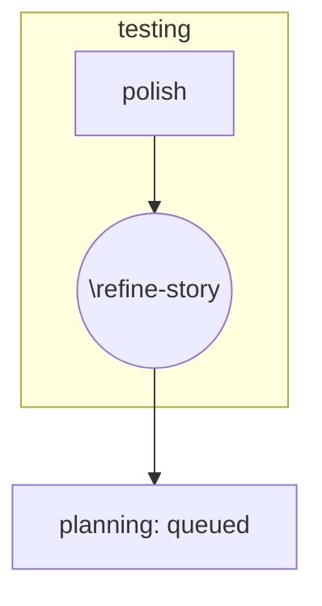

Refine a story based on human feedback during testing validation.

## Trigger

This skill is invoked when a story-node has:
- `stage = 'testing'`
- `status = 'polish'`

**Prerequisite:** Human must have provided refinement notes in the `notes` field.

## Arguments

$Arguments

- **With story ID**: Refine the specified story
- **Without arguments**: Auto-discover stories with `stage='testing'` and `status='polish'`

## Process

### 1. Find Polish Story

```python
python -c "
import sqlite3, json
conn = sqlite3.connect('${STORYTREE_DATA_DIR}/story-tree.db')
conn.row_factory = sqlite3.Row

stories = [dict(row) for row in conn.execute('''
    SELECT id, title, description, notes, stage, status
    FROM story_nodes
    WHERE stage = 'testing' AND status = 'polish'
    ORDER BY updated_at ASC
    LIMIT 1
''').fetchall()]

if stories:
    print(json.dumps({'found': True, 'story': stories[0]}, indent=2))
else:
    print(json.dumps({'found': False, 'message': 'No polish stories found'}, indent=2))
conn.close()
"
```

### 2. Validate Human Notes Exist

If `notes` field is empty or missing refinement instructions:
- **EXIT** with message: "Cannot refine story without human notes. Please add refinement instructions to the notes field."

### 3. Parse Refinement Instructions

Extract from notes:
- What needs to change (acceptance criteria, UI/UX, component behavior)
- Why it needs to change (user feedback, validation findings)
- Any constraints or preferences

### 4. Apply Refinements

Update the story based on human notes:
- Revise acceptance criteria as instructed
- Update UI/UX specifications if mentioned
- Modify component requirements as needed
- Preserve unchanged elements

### 5. Transition to Planning

```python
python -c "
import sqlite3
from datetime import datetime

conn = sqlite3.connect('${STORYTREE_DATA_DIR}/story-tree.db')
cursor = conn.cursor()

story_id = 'STORY_ID'
refined_description = '''REFINED_DESCRIPTION'''
refinement_summary = '''WHAT_WAS_CHANGED'''

# Get current notes
cursor.execute('SELECT notes FROM story_nodes WHERE id = ?', (story_id,))
current_notes = cursor.fetchone()[0] or ''

# Archive refinement
timestamp = datetime.now().strftime('%Y-%m-%d %H:%M')
archive_entry = f'''

---
**Refinement Applied ({timestamp}):**
{refinement_summary}
---
'''

# Update story and transition to planning:queued
cursor.execute('''
    UPDATE story_nodes
    SET description = ?,
        notes = ?,
        stage = 'planning',
        status = 'queued',
        updated_at = datetime('now')
    WHERE id = ?
''', (refined_description, current_notes + archive_entry, story_id))

conn.commit()
conn.close()
print(f'Refined and queued for re-planning: {story_id}')
"
```

## Stage Diagram



## Output

- "Refined and queued for re-planning: [ID]"
- "Cannot refine story without human notes"
- "No polish stories found"

## Does NOT

- Create new stories
- Execute implementation
- Run verification tests
- Make autonomous decisions about what to change (human notes required)

## References

- **Workflow diagram:** `.claude/skills/story-tree/references/workflow4-testing-C.md`
- **Three-field model:** `.claude/skills/story-tree/references/workflow-three-field-model.md`
- **Database:** `${STORYTREE_DATA_DIR}/story-tree.db`
