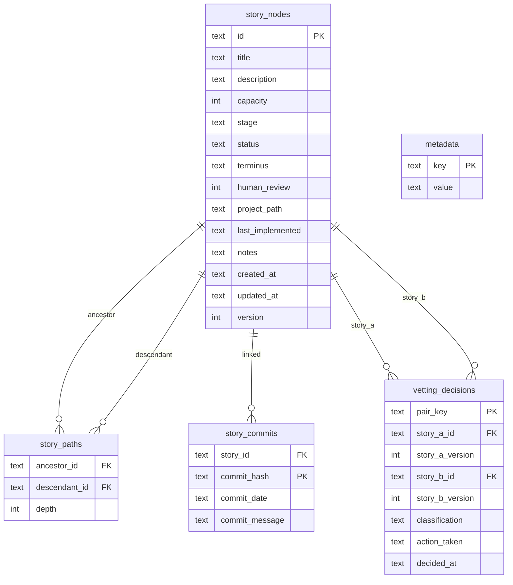
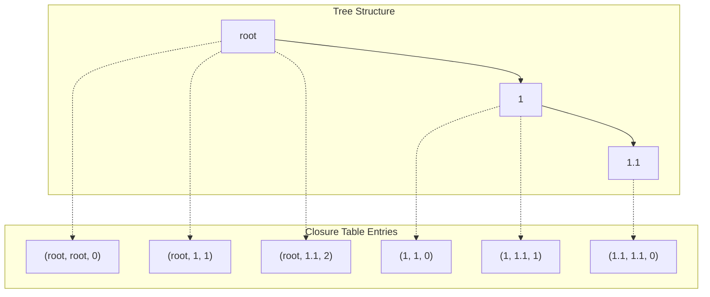
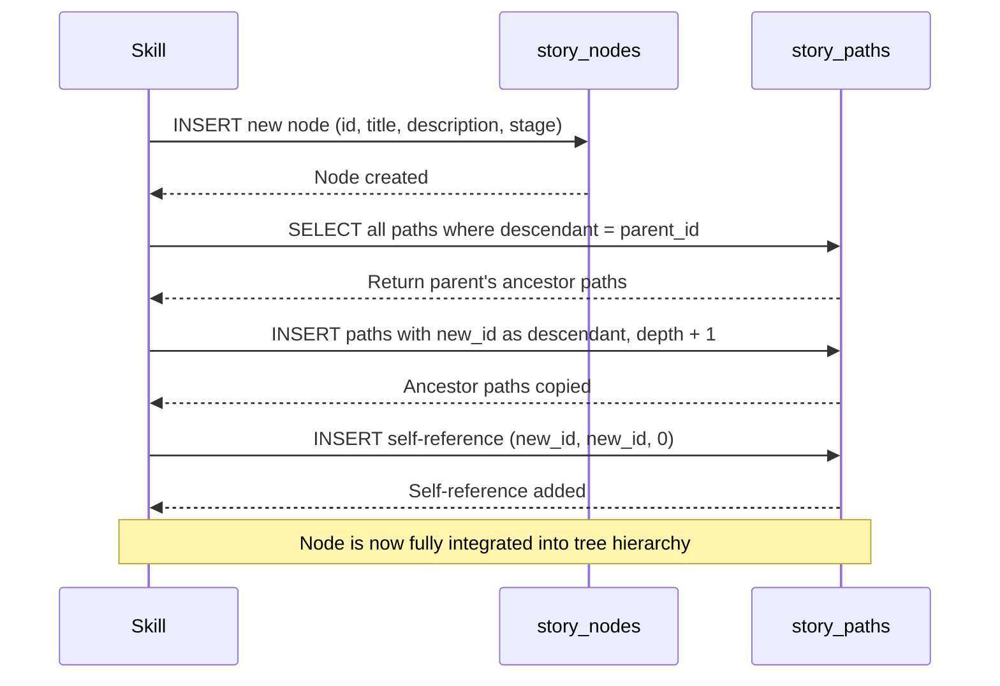
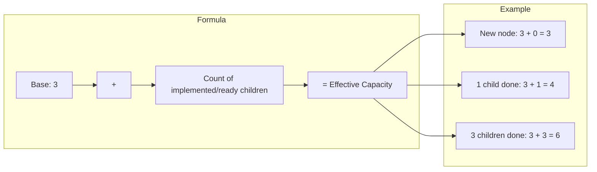

# Database Architecture

Visual representations of the database schema and closure table patterns used by the story-tree system.

---

## Definitions

| Term | Definition |
|------|------------|
| **Story node** | A unit of work in the hierarchical backlog—can be an epic, feature, capability, or task depending on depth. May have its own direct work AND children simultaneously. |
| **Closure table** | A database pattern that stores all ancestor-descendant relationships, enabling efficient hierarchy queries |
| **Capacity** | The maximum number of children a node can have; grows dynamically based on completed work |
| **Depth** | A node's level in the tree (root=0, features=1, capabilities=2, tasks=3+) |

---

## Closure Table Data Structure

The closure table pattern stores all ancestor-descendant relationships, enabling efficient hierarchy queries without recursion.

For details on `stage`, `status`, and `terminus` values, see @workflow-three-field-model.md. For the complete SQL schema including constraints and indexes, see @schema.sql.

---

## Closure Table Path Example

This diagram illustrates how the closure table stores paths for a simple three-node hierarchy. Note the ID format: first-level children of root are plain integers (`1`, `2`), while deeper nodes use dotted format (`1.1`, `1.1.1`).

Each entry represents a path from ancestor to descendant with the distance between them. Self-references (depth 0) ensure every node appears in queries. This structure allows finding all descendants or ancestors with a single query.

---

## Node Insertion Process

Adding a new node requires updating both the nodes table and the closure table.

---

## Dynamic Capacity Calculation

Capacity grows organically based on completed work rather than speculation.

