# Debug Ladder Workflow

> **Debugging is orthogonal to pipeline stages.** The `broken` hold state can occur at any stage where implementation work exists (executing, reviewing, verifying). This document defines the debug ladder as a cross-cutting workflow that connects to the main pipeline.

---

## Orthogonal Architecture

The three-field model correctly separates:
- **Stages** (where in lifecycle) — linear progression
- **Holds** (operational condition) — orthogonal to stages, pausable from any point
- **Dispositions** (terminal outcomes) — exclusive final states

The `broken` hold state is validated by industry patterns:
- **Kubernetes**: Pod phase (Running) is independent of conditions (Ready: false)
- **CI/CD systems**: Pipeline stages are independent of execution status (FAILURE, UNSTABLE)
- **ITIL**: Incident management runs as a parallel track to normal operations
- **Harel statecharts**: Orthogonal regions reduce N×M states to N+M states

For detailed research, see: `ai_docs/Research/2025-12-28-orthoganol-debugging-research.md`

---

## Entry Points to Broken Hold

```mermaid
flowchart TB
    subgraph stages [Pipeline Stages]
        executing[executing]
        reviewing[reviewing]
        verifying[verifying]
    end

    subgraph broken_hold [Broken Hold State]
        broken[🔥 broken]
        debug_ladder[Debug Ladder]
        escalated[⏳ escalated]
    end

    executing -->|"tests fail"| broken
    reviewing -->|"code review finds bugs"| broken
    verifying -->|"integration tests fail"| broken

    broken --> debug_ladder
    debug_ladder -->|"fix succeeds"| return((return to stage))
    debug_ladder -->|"5 attempts fail"| escalated

    return --> executing
    return --> reviewing
    return --> verifying
    escalated --> human((👤 Human review))

    classDef executingBox fill:#00CCCC,stroke:#00A3A3,color:#fff
    classDef reviewingBox fill:#0099CC,stroke:#007AA3,color:#fff
    classDef verifyingBox fill:#0066CC,stroke:#0052A3,color:#fff
    classDef brokenBox fill:#FF6B6B,stroke:#CC5555,color:#fff
    classDef debugBox fill:#9966CC,stroke:#7A52A3,color:#fff
    classDef escalatedBox fill:#FFB84D,stroke:#CC9340,color:#fff
    class executing executingBox
    class reviewing reviewingBox
    class verifying verifyingBox
    class broken brokenBox
    class debug_ladder debugBox
    class escalated escalatedBox
```



---

## Debug Ladder

Stories that enter the `broken` hold progress through a 5-step debugging ladder:


### Step Details

| Step | Tool | Purpose |
|------|------|---------|
| 1 | `code-sentinel` | Fix known anti-patterns from `test_code_patterns.py` |
| 2 | `superpowers:root-cause-tracing` | Trace backward to error source |
| 3 | `librarian agent` | Research outdated APIs, version mismatches |
| 4 | Opus 4.5 | Fresh analysis with optimized handover prompt |
| 5 | `superpowers:systematic-debugging` | Full 4-phase debugging framework |
| 6 | **Escalate** | → `escalated` hold for human review |

Each step attempts to fix the issue. On success, the story returns to its previous stage (using history state) and retries. On failure, the next step is tried.

---

## Debug Orchestrator Flow

```mermaid
flowchart TB
    subgraph inputs ["Inputs"]
        story_id[story_id]
        error_context[error context]
        attempt_count[attempt count]
    end

    subgraph debug_orchestrator ["Debug Orchestrator"]
        check_attempts{Attempts < 5?}
        select_step[Select debug step<br/>based on attempt #]
        run_step[Run selected<br/>debug tool]
        verify[Verify fix:<br/>re-run tests]
        verify_result{Tests pass?}
        increment[Increment<br/>attempt count]
    end

    subgraph outcomes ["Outcomes"]
        clear[Return to previous stage]
        escalated[⏳ escalated]
    end

    story_id --> check_attempts
    error_context --> run_step
    attempt_count --> check_attempts
    check_attempts -->|yes| select_step
    check_attempts -->|no (5 failures)| escalated
    select_step --> run_step
    run_step --> verify
    verify --> verify_result
    verify_result -->|yes| clear
    verify_result -->|no| increment
    increment --> check_attempts

    classDef inputBox fill:#FFD700,stroke:#B8860B,color:#000
    classDef debugBox fill:#9966CC,stroke:#7A52A3,color:#fff
    classDef clearBox fill:#00CCCC,stroke:#00A3A3,color:#fff
    classDef escalatedBox fill:#FFB84D,stroke:#CC9340,color:#fff
    class inputs inputBox
    class debug_orchestrator debugBox
    class clear clearBox
    class escalated escalatedBox
```

---

## Stage-Specific Connections

### From Executing

Stories at `executing (no hold)` transition to `broken` when:
- `/ci-execute-plan` returns `partial` or `failed`
- Tests fail during TDD implementation
- Build errors occur

### From Reviewing

Stories at `reviewing` transition to `broken` when:
- Code review identifies implementation bugs
- Static analysis finds critical issues
- Security scanning detects vulnerabilities

### From Verifying

Stories at `verifying` transition to `broken` when:
- Integration tests fail
- End-to-end tests fail
- Performance tests fail thresholds

---

## History State Resumption

When a story exits `broken` hold after a successful fix, it returns to the exact stage it occupied before entering the hold. This follows Harel's **history state (H)** pattern:

1. Story at `reviewing (no hold)` encounters bug
2. Story transitions to `reviewing (broken)`
3. Debug ladder fixes issue
4. Story returns to `reviewing (no hold)` — not back to `executing`

This preserves workflow progress and avoids re-implementing completed work.

---

## Database Fields

| Field | Type | Purpose |
|-------|------|---------|
| `debug_attempts` | INTEGER | Count of debug ladder attempts (0-5) |
| `status` | TEXT | Current hold state (e.g., `broken`, `escalated`) |
| `previous_stage` | TEXT | Stage before entering broken (for history state) |

---

## Escalation Patterns

The debug ladder implements progressive escalation:

```
broken → [code-sentinel] → [root-cause-tracing] → [librarian] → [Opus 4.5] → [systematic] → escalated
```

After escalation, human review determines next steps:
- **Fix identified**: Return to previous stage
- **Scope change needed**: Return to `planning`
- **Story infeasible**: Disposition to `infeasible`
- **External blocker**: Transition to `blocked` hold
