# Workflow Orchestrator

This document defines the three-field workflow model and describes how the orchestrator implements the story-tree workflow stages.

> **Reference specs:** `.claude/skills/story-tree/references/workflow1-concept.md` through `workflow6-shipped.md`

---

## Three-Field Model

Stories progress through stages, with holds and terminal states as orthogonal dimensions:

### Definitions

| Term | Definition |
|------|------------|
| **Story node** | A unit of work in the hierarchical backlog—can be an epic, feature, capability, or task depending on depth. May have its own direct work AND children simultaneously. |

### Stages

| Stage | Definition |
|-------|------------|
| **concept** | New idea proposed |
| **planning** | Implementation being planned; dependencies being verified |
| **implementing** | Own code in progress; children's code in progress |
| **testing** | Verifying implementation works; waiting for children; human verifies "Did I see it work?" |
| **releasing** | Final checks, cleanup session, stakeholder sign-off |
| **shipped** | Deployed/released |

### Hold States

| Hold States | Definition |
|------|------------|
| *(no hold)* | Story is not blocked and can progress |
| **🔥 broken** | Implementation has issues |
| **⚔ conflicted** | Scope overlaps another story |
| **🚧 blocked** | External dependency missing (not a choice to stop) |
| **⏳ escalated** | Requires human decision |
| **⏸ paused** | Intentionally stopped (not blocked by external factors) |
| **💎 polish** | Minor refinements before progressing |
| **📋 queued** | Processing delayed pending completion of prerequisite steps |
| **💭 wishlisted** | Low priority, indefinite deferral |

### Terminal States

| Terminal States | Definition |
|-----------------|------------|
| *(not terminal)* | Story remains active in the tree |
| **🚫 infeasible** | Cannot be built |
| **❌ rejected** | Explicitly declined |
| **👯 duplicative** | Duplicate of another story |
| **⚠️ deprecated** | No longer recommended |
| **🛑 legacy** | Outdated or superseded |
| **📦 archived** | Stored away for reference |

---

## Stage Transitions

```mermaid
flowchart LR
    concept[concept]
    planning[planning]
    implementing[implementing]
    testing[testing]
    releasing[releasing]
    shipped[shipped]

    concept -->|approved| planning
    planning -->|auto-queue| implementing
    implementing -->|completed| testing
    testing -->|human approved| releasing
    releasing -->|stakeholder approved| shipped

    classDef conceptBox fill:#66CC00,stroke:#52A300,color:#fff
    classDef planningBox fill:#00CC66,stroke:#00A352,color:#fff
    classDef implementingBox fill:#00CCCC,stroke:#00A3A3,color:#fff
    classDef testingBox fill:#0099CC,stroke:#007AA3,color:#fff
    classDef releasingBox fill:#0066CC,stroke:#0052A3,color:#fff
    classDef shippedBox fill:#0033CC,stroke:#0029A3,color:#fff
    class concept conceptBox
    class planning planningBox
    class implementing implementingBox
    class testing testingBox
    class releasing releasingBox
    class shipped shippedBox
```

---

## Detailed Stage Workflows

For detailed diagrams of each stage's internal workflow:

| Stage | Details |
|-------|---------|
| concept | @workflow1-concept.md |
| planning | @workflow2-planning.md |
| implementing | @workflow3-implementing.md |
| testing | @workflow4-testing.md |
| releasing | @workflow5-releasing.md |
| shipped | @workflow6-shipped.md |

---

## Orthogonal Workflows

Some workflows are cross-cutting concerns that can occur at multiple stages:

| Workflow | Details |
|----------|---------|
| Debugging (broken hold) | @workflow-debugging.md |
| Code Review | `/AI-review` command (runs before escalation) |

The `broken` hold state is orthogonal to pipeline stages—it can occur at any stage where implementation work exists (implementing, testing, releasing). See the debugging workflow for the 5-step debug ladder and escalation patterns.

Code review via `/AI-review` is also orthogonal—it runs automatically before any `escalated` transition to provide fresh review reports for human decision-making.

---

## The Heartbeat Model

The orchestrator operates on a **heartbeat** principle:

```
┌─────────────────────────────────────────────────────────────┐
│                      ONE HEARTBEAT                          │
├─────────────────────────────────────────────────────────────┤
│  1. Query stories by (stage, status)                        │
│  2. Run command sequence for that state                     │
│  3. STOP when stage, status, or terminus changes            │
│  4. Story waits at new state for next heartbeat             │
└─────────────────────────────────────────────────────────────┘
```

**Key principles:**

| Principle | Description |
|-----------|-------------|
| **One transition per heartbeat** | Each run advances a story exactly one "step" until it hits a gate |
| **Gates are state changes** | A gate is any change to `stage`, `status`, or `terminus` |
| **Human checkpoints = escalation** | When workflow shows 👤, the heartbeat stops with `status = 'escalated'` |
| **Predictable progression** | Stories move through defined paths, never skip steps |

---

## GitHub Actions Architecture

Each heartbeat diagram maps to **one workflow file** with **multiple steps**. Shared operations use **composite actions** for DRY.

```
.github/workflows/
├── 0rchestrator.yml                    # Dispatcher
├── heartbeat-concept-nohold.yml        # write → vet (2 Claude invocations)
├── heartbeat-concept-polish.yml        # refine → vet (2 Claude invocations)
├── heartbeat-implementing-nohold.yml   # review → decompose/implement → code-review
└── ...

.github/actions/
├── vet-concept/action.yml              # Shared: used by concept-nohold AND concept-polish
├── write-concept/action.yml
├── refine-concept/action.yml
└── ...
```

**Context isolation:** Each step calls `anthropics/claude-code-action@v1` independently—fresh Claude invocation with no memory of previous steps. More focused context improves performance and saves tokens.

### Why This Structure

| Advantage | Mechanism |
|-----------|-----------|
| **Step-level retry** | [Re-run failed jobs](https://docs.github.com/en/actions/how-tos/manage-workflow-runs/re-run-workflows-and-jobs) without repeating successful steps |
| **Zero dispatch latency** | Steps run sequentially in one job; no API calls between operations |
| **Atomic heartbeats** | Either the heartbeat completes or it doesn't—no partial state |
| **Shared operations** | [Composite actions](https://docs.github.com/en/actions/sharing-automations/creating-actions/creating-a-composite-action) inherit environment and checkout |
| **Lower API usage** | One workflow dispatch per heartbeat vs. per operation |

### Composite Action Pattern

Composite actions run inline within the calling job, sharing the checkout and environment. Unlike reusable workflows, they don't spawn separate jobs.

```yaml
# .github/actions/vet-concept/action.yml
name: Vet Concept
inputs:
  story_id:
    required: true
runs:
  using: composite
  steps:
    - uses: anthropics/claude-code-action@v1
      with:
        prompt: "Vet concept for story ${{ inputs.story_id }}..."
```

```yaml
# heartbeat-concept-nohold.yml — uses composite action
steps:
  - uses: ./.github/actions/write-concept
  - uses: ./.github/actions/vet-concept  # Same action reused in concept-polish
```

**References:**
- [Creating composite actions](https://docs.github.com/en/actions/sharing-automations/creating-actions/creating-a-composite-action) — GitHub Docs
- [Composite Actions vs Reusable Workflows](https://wallis.dev/blog/composite-github-actions) — practical comparison
- [Reusable workflow patterns](https://victoronsoftware.com/posts/github-reusable-workflows-and-steps/) — 2024 guide

---

## Heartbeat Diagrams

## Broken Hold State (Orthogonal)

The "broken" hold state is **orthogonal to workflow stages**—debugging follows the same process regardless of which stage a story occupies. This reflects the principle that "where you are in the workflow" and "what condition the work is in" are independent dimensions.

> **Reference:** `ai_docs/Research/2025-12-28-orthoganol-debugging-research.md`

### Debug Cycle

When any story enters the broken state, the debug ladder attempts repairs with up to 5 retry attempts:

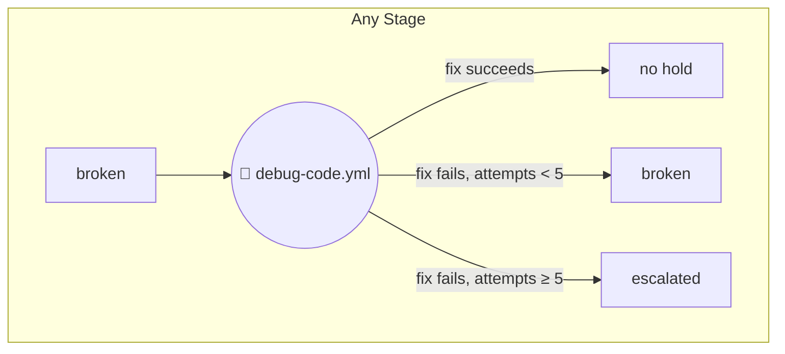

**Key behaviors:**
- Story remains at its current stage throughout debugging
- Attempt counter increments on each debug cycle
- After 5 failed attempts, story escalates for human intervention
- Successful fix clears hold, allowing normal workflow to resume

---

## Shipped Stage

**No heartbeat diagrams.** `shipped` is a terminal state with no hold states and no further transitions. Stories reaching shipped remain as historical records. Any bugs, enhancements, or rollbacks create new stories at `concept` stage.

---

## Releasing Stage Heartbeat Diagrams

### Releasing: escalated → Shipped (Stage Transition)

After stakeholder approves the release, story transitions to shipped:

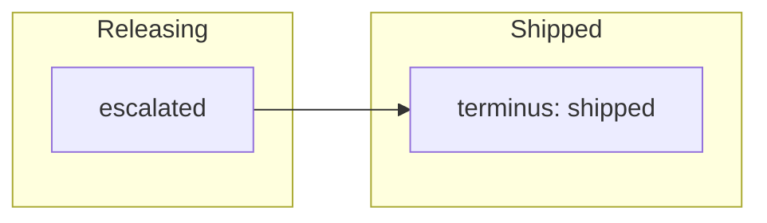

---

### Releasing: no hold → Final Checks and AI Review

From no hold, automated checks run (build, lint, security). If all pass, AI review executes before stakeholder sign-off:

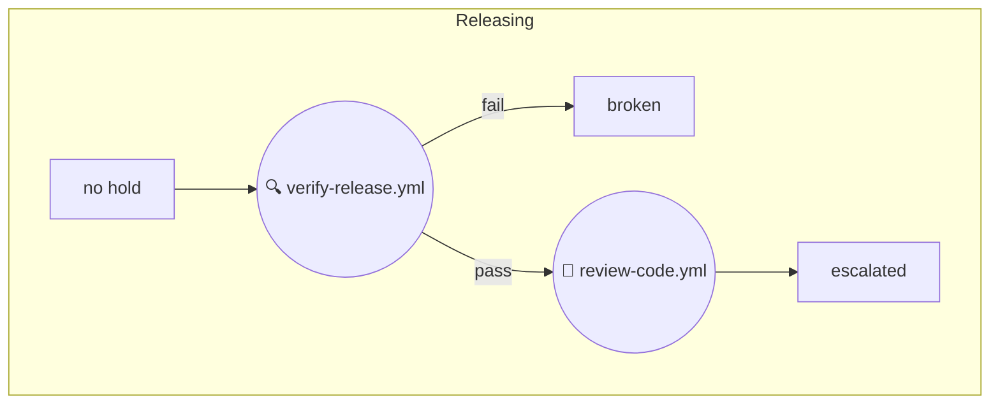

---

### Releasing: queued → Child Readiness

Stories wait in queued until all children reach releasing or beyond:

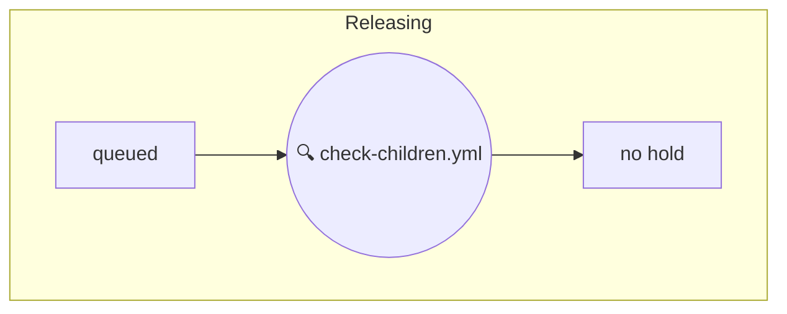

---

## Testing Stage Heartbeat Diagrams

### Testing: polish → Implementing (Stage Transition)

When human validation requests refinement, story undergoes refinement and refactoring, transitioning back to implementing:

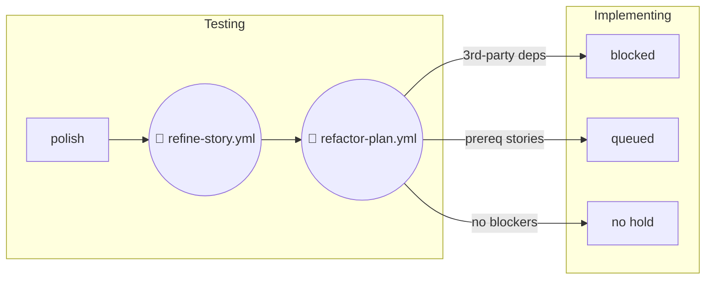

---

### Testing: queued → Correction Cycle

When verification fails, the correction cycle attempts to fix issues and prepare for re-verification:

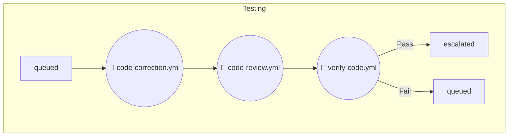

---

### Testing: no hold → Verification

Story enters testing after human approves implementation. Verification runs to check if tests pass and acceptance criteria are met:

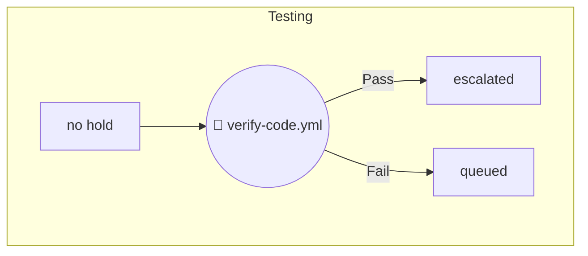

---

## Implementing Stage Heartbeat Diagrams

### Implementing: no hold → Plan Review, Decompose/Implement, Code Review

From no hold, the plan is reviewed to determine the next action. Based on complexity, it either decomposes into sub-plans, implements directly, or proceeds to code review when all sub-plans are complete:

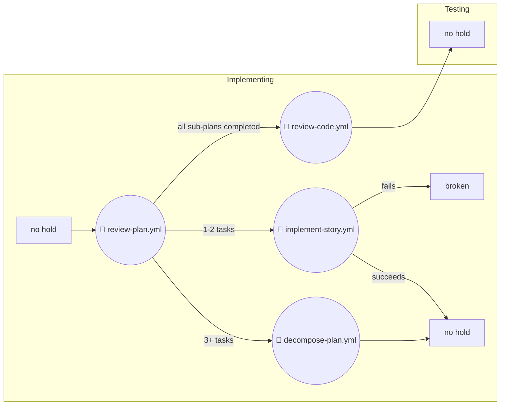

---

### Implementing: queued → Prerequisite Check

Stories wait until all prerequisite stories reach implemented stage or beyond:

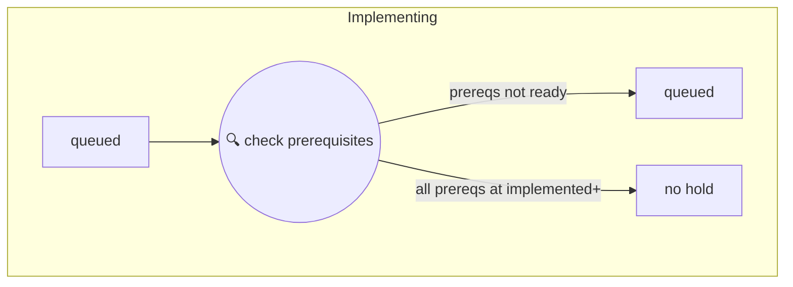

---

### Implementing: blocked → Dependency Resolution

Stories blocked on 3rd-party dependencies wait until all dependency child stories reach planning stage or beyond:

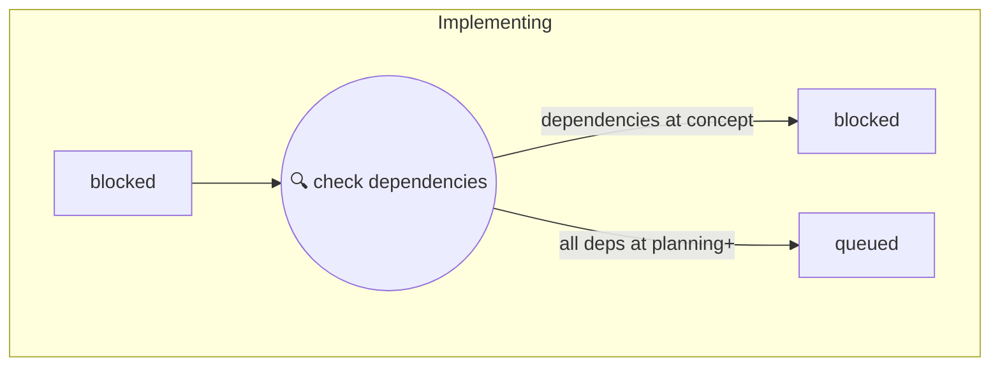

---

## Planning Stage Heartbeat Diagrams

### Planning: queued → Implementing (Stage Transition)

After human approves design, implementation planning runs and transitions to implementing:

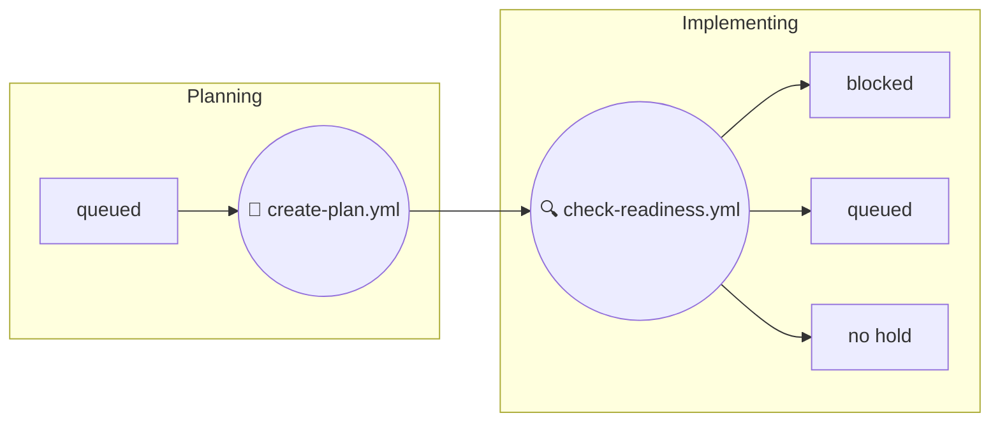

---

### Planning: polish → Refine Cycle

After human requests design refinement, the story re-enters AI processing:

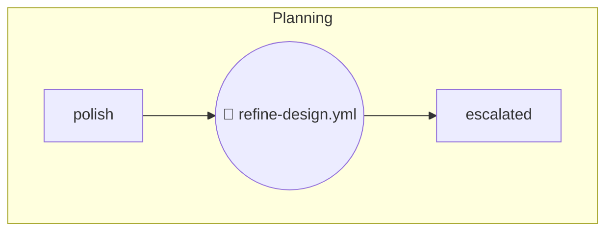

---

### Planning: no hold → Design Escalation

Stories entering planning with no hold get their design generated:

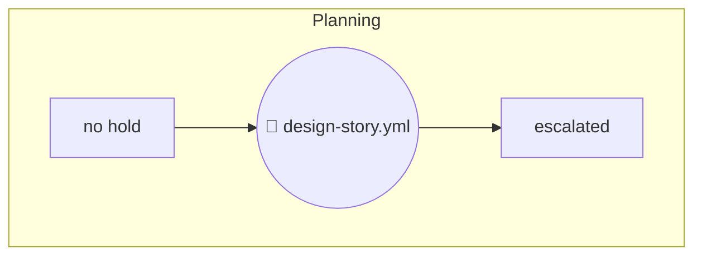

---

## Concept Stage Heartbeat Diagrams

### Concept: duplicative → Deletion

Duplicative concepts are marked for deletion:

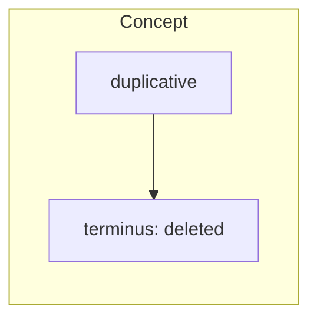

---

### Concept: polish → Refine Cycle

After human requests polish, the story re-enters AI processing:

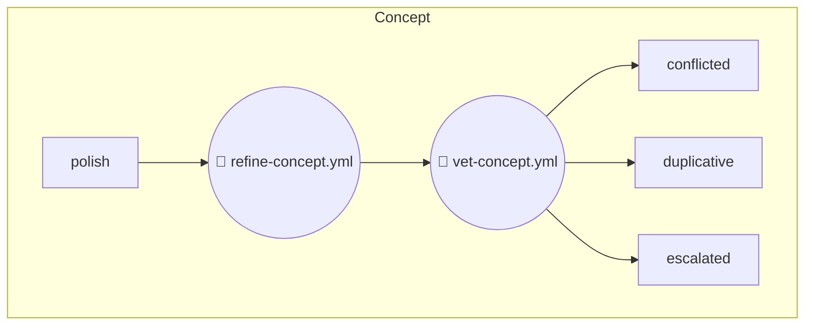

---

### Concept: no hold → Write and Vet


The story now waits. The next heartbeat will pick it up based on its new state.
