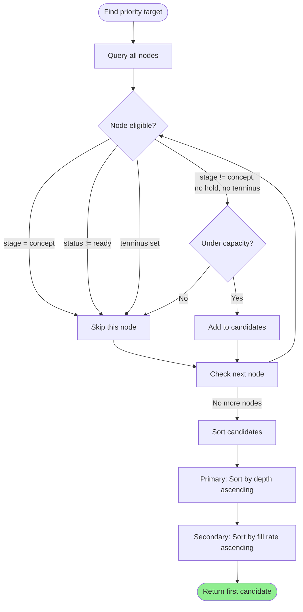
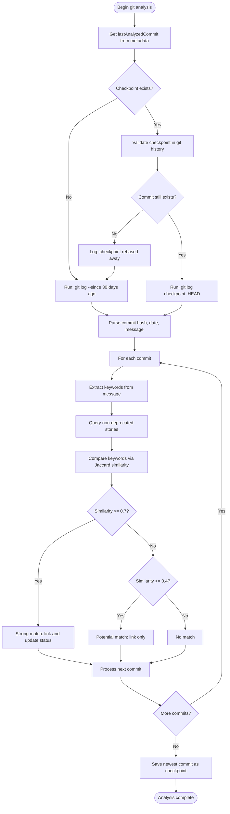
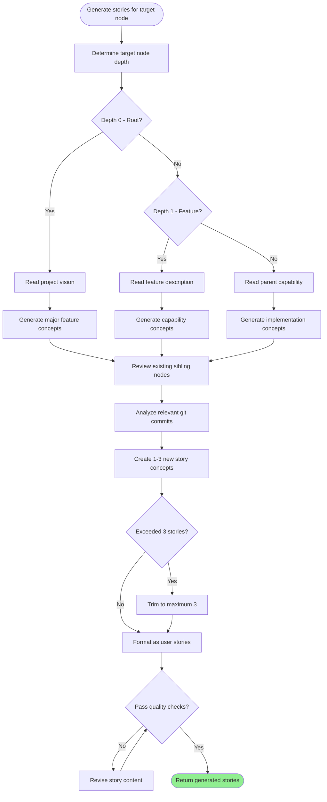

# Skill Workflows

Visual representations of the operational workflows executed by story-tree skills.

---

## Definitions

| Term | Definition |
|------|------------|
| **Story node** | A unit of work in the hierarchical backlog—can be an epic, feature, capability, or task depending on depth. May have its own direct work AND children simultaneously. |
| **Depth** | A node's level in the tree (root=0, features=1, capabilities=2, tasks=3+) |
| **Fill rate** | Ratio of current children to capacity; used for prioritization |
| **Checkpoint** | The last analyzed git commit hash; enables incremental scanning |

---

## Main Update Workflow

The primary workflow executes when the skill receives an update command. It proceeds through seven sequential steps.

```mermaid
flowchart TD
    START([User invokes skill]) --> STALE{Database > 3 days old?}
    STALE -->|Yes| FORCE[Force full update first]
    FORCE --> STEP1
    STALE -->|No| STEP1

    STEP1[Step 1: Load Current Tree] --> DB_EXISTS{Database exists?}
    DB_EXISTS -->|No| INIT[Initialize new database]
    INIT --> SEED[Seed root node from project metadata]
    SEED --> STEP2
    DB_EXISTS -->|Yes| STEP2

    STEP2[Step 2: Analyze Git Commits] --> CHECKPOINT{Valid checkpoint exists?}
    CHECKPOINT -->|Yes| INCREMENTAL[Incremental scan from checkpoint]
    CHECKPOINT -->|No| FULL[Full 30-day scan]
    INCREMENTAL --> MATCH
    FULL --> MATCH
    MATCH[Match commits to stories] --> UPDATE_STATUS[Update story statuses]
    UPDATE_STATUS --> SAVE_CHECKPOINT[Save new checkpoint]
    SAVE_CHECKPOINT --> STEP3

    STEP3[Step 3: Calculate Tree Metrics] --> METRICS[Query depth, child count, fill rate per node]
    METRICS --> STEP4

    STEP4[Step 4: Identify Priority Target] --> FILTER[Filter eligible nodes]
    FILTER --> SORT[Sort by depth then fill rate]
    SORT --> SELECT[Select top priority node]
    SELECT --> STEP5

    STEP5[Step 5: Generate Stories] --> CONTEXT[Gather parent and sibling context]
    CONTEXT --> GENERATE[Generate 1-3 concept stories]
    GENERATE --> VALIDATE[Validate against quality checks]
    VALIDATE --> STEP6

    STEP6[Step 6: Update Tree] --> INSERT[Insert new nodes]
    INSERT --> CLOSURE[Populate closure table paths]
    CLOSURE --> TIMESTAMP[Update lastUpdated metadata]
    TIMESTAMP --> STEP7

    STEP7[Step 7: Output Report] --> REPORT([Generate summary report])
```

---

## Priority Algorithm Decision Flow

The priority algorithm determines which node should receive new children. Depth takes absolute precedence over fill rate.

---

## Git Commit Analysis Process

The skill analyzes git history to detect implementation progress and update story statuses.

---

## Story Generation Flow

When a priority target is identified, the skill generates contextually appropriate stories.

