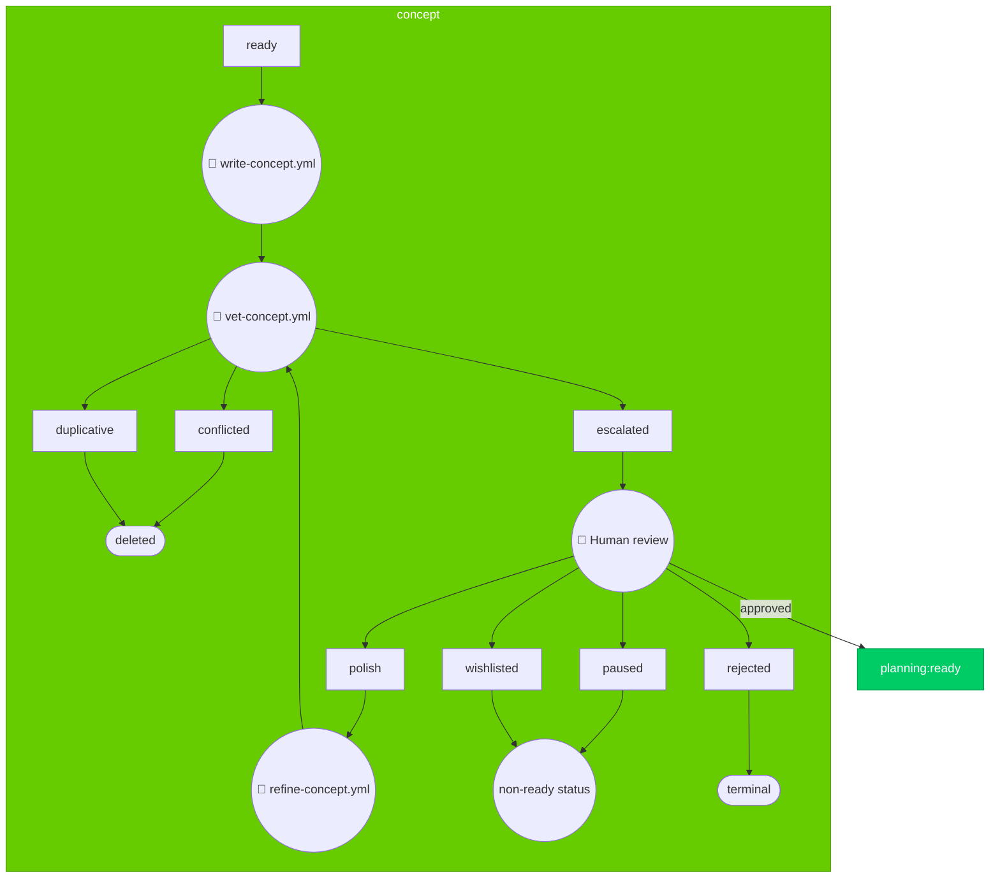
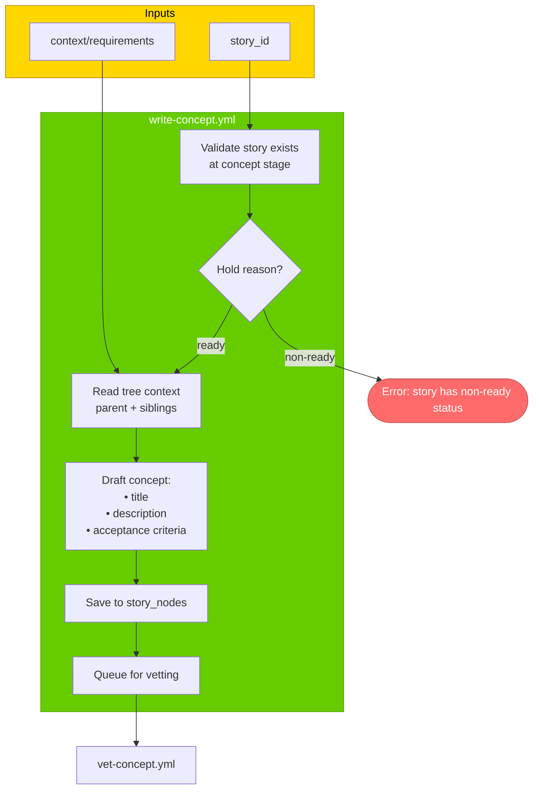
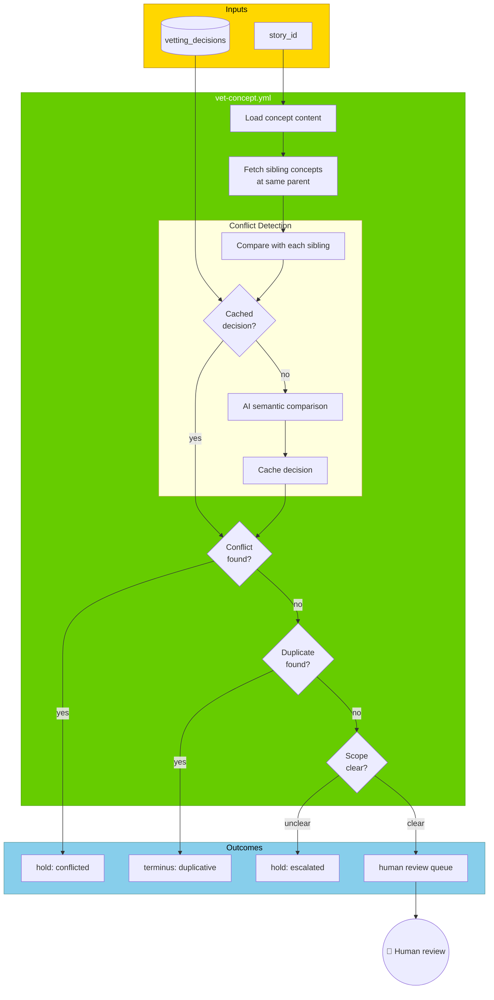
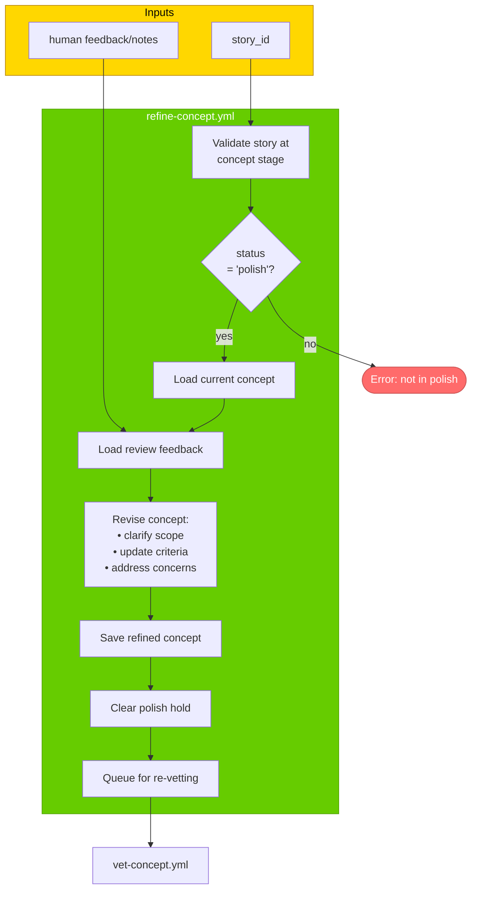

# Concept Stage

> For definitions of stages, statuses, and terminal states, see @workflow-three-field-model.md

---

## Stage Diagram

---

## Command Diagrams

### 🤖 write-concept.yml

---

### 🤖 vet-concept.yml

---

### 🤖 refine-concept.yml

