# Concept Stage

> For definitions of stages, statuses, and terminal states, see @workflow-three-field-model.md

---

## Stage Diagram

---

## Command Diagrams

### 🤖 write-concept.yml

```mermaid
flowchart TB
    subgraph inputs ["Inputs"]
        story_id[story_id]
        context[context/requirements]
    end

    subgraph write_concept ["write-concept.yml"]
        validate[Validate story exists<br/>at concept stage]
        check_hold{Hold reason?}
        read_tree[Read tree context<br/>parent + siblings]
        draft[Draft concept:<br/>• title<br/>• description<br/>• acceptance criteria]
        save[Save to story_nodes]
        queue[Queue for vetting]
    end

    story_id --> validate
    context --> read_tree
    validate --> check_hold
    check_hold -->|ready| read_tree
    check_hold -->|non-ready| error([Error: story has non-ready status])
    read_tree --> draft
    draft --> save
    save --> queue

    queue --> vet["vet-concept.yml"]

    classDef inputBox fill:#FFD700,stroke:#B8860B,color:#000
    classDef processBox fill:#66CC00,stroke:#52A300,color:#fff
    classDef errorBox fill:#FF6B6B,stroke:#CC5555,color:#fff
    class inputs inputBox
    class write_concept processBox
    class error errorBox
```

---

### 🤖 vet-concept.yml

```mermaid
flowchart TB
    subgraph inputs ["Inputs"]
        story_id[story_id]
        vetting_cache[(vetting_decisions)]
    end

    subgraph vet_concept ["vet-concept.yml"]
        load[Load concept content]
        fetch_siblings[Fetch sibling concepts<br/>at same parent]

        subgraph conflict_check ["Conflict Detection"]
            compare[Compare with each sibling]
            cache_hit{Cached<br/>decision?}
            ai_compare[AI semantic comparison]
            cache_save[Cache decision]
        end

        conflict_found{Conflict<br/>found?}
        dup_found{Duplicate<br/>found?}
        scope_ok{Scope<br/>clear?}
    end

    subgraph outcomes ["Outcomes"]
        conflicted[hold: conflicted]
        duplicative[terminus: duplicative]
        escalated[hold: escalated]
        approved[human review queue]
    end

    story_id --> load
    vetting_cache --> cache_hit
    load --> fetch_siblings
    fetch_siblings --> compare
    compare --> cache_hit
    cache_hit -->|yes| conflict_found
    cache_hit -->|no| ai_compare
    ai_compare --> cache_save
    cache_save --> conflict_found

    conflict_found -->|yes| conflicted
    conflict_found -->|no| dup_found
    dup_found -->|yes| duplicative
    dup_found -->|no| scope_ok
    scope_ok -->|unclear| escalated
    scope_ok -->|clear| approved

    approved --> human((👤 Human review))

    classDef inputBox fill:#FFD700,stroke:#B8860B,color:#000
    classDef processBox fill:#66CC00,stroke:#52A300,color:#fff
    classDef outcomeBox fill:#87CEEB,stroke:#5F9EA0,color:#000
    class inputs inputBox
    class vet_concept processBox
    class outcomes outcomeBox
```

---

### 🤖 refine-concept.yml

```mermaid
flowchart TB
    subgraph inputs ["Inputs"]
        story_id[story_id]
        feedback[human feedback/notes]
    end

    subgraph refine_concept ["refine-concept.yml"]
        validate[Validate story at<br/>concept stage]
        check_polish{status<br/>= 'polish'?}
        load[Load current concept]
        load_feedback[Load review feedback]
        revise[Revise concept:<br/>• clarify scope<br/>• update criteria<br/>• address concerns]
        save[Save refined concept]
        clear_hold[Clear polish hold]
        queue[Queue for re-vetting]
    end

    story_id --> validate
    feedback --> load_feedback
    validate --> check_polish
    check_polish -->|no| error([Error: not in polish])
    check_polish -->|yes| load
    load --> load_feedback
    load_feedback --> revise
    revise --> save
    save --> clear_hold
    clear_hold --> queue

    queue --> vet["vet-concept.yml"]

    classDef inputBox fill:#FFD700,stroke:#B8860B,color:#000
    classDef processBox fill:#66CC00,stroke:#52A300,color:#fff
    classDef errorBox fill:#FF6B6B,stroke:#CC5555,color:#fff
    class inputs inputBox
    class refine_concept processBox
    class error errorBox
```

