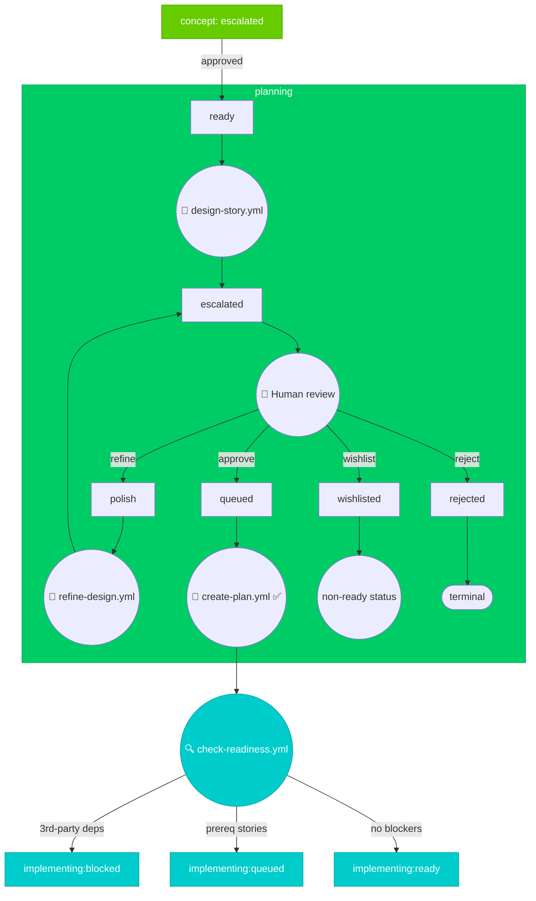
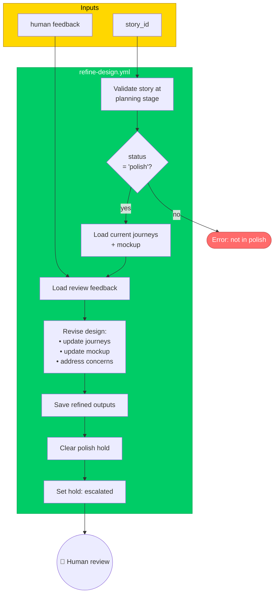

# Planning Stage

> For definitions of stages, statuses, and terminal states, see @workflow-three-field-model.md

---

## Stage Diagram



---

## Workflow Description

### Entry
Stories enter planning with **ready** status after human approval in concept stage.

### Phase 1: Design Generation

The `design-story.yml` command generates user journeys and mockups:

1. **Read context** — Load `goals.md`, `non-goals.md` from story context
2. **Generate user journeys** — Create journey descriptions based on story goals
3. **Read design patterns** — Load `patterns.md`, `anti-patterns.md` (from synthesize-designs)
4. **Create mockup** — Generate UI/UX mockup based on journeys and patterns
5. **Save outputs**:
   - User journeys → `user_journeys` field on story_node (JSON array)
   - Mockup → `${STORYTREE_DATA_DIR}/mockups/{story_id}.md`
6. **Escalate** → `planning (escalated)` for human review

### Phase 2: Human Review

Human reviews the user journeys and mockup:

| Decision | Result |
|----------|--------|
| **approve** | → `planning (queued)` — ready for implementation planning |
| **refine** | → `planning (polish)` — AI refines based on feedback |
| **wishlist** | → `planning (wishlisted)` — low priority, indefinite deferral |
| **reject** | → `terminus: rejected` — explicitly declined |

### Phase 3: Implementation Planning

The `create-plan.yml` command creates a TDD implementation plan:

1. **Research codebase** — Understand existing architecture, patterns, and conventions
2. **Draft TDD plan** — Write test scenarios first, then implementation steps
3. **Generate plan file** — Output to `${STORYTREE_DATA_DIR}/plans/{NNN}_{slug}.md`
4. **Identify dependencies** — Check for 3rd-party libs, APIs, external services
5. **Identify prerequisites** — Check for other stories that must complete first
6. **Update story_node fields**:
   - `dependencies` — JSON array of 3rd-party deps (e.g., `["redis", "stripe-api"]`)
   - `prerequisites` — JSON array of story IDs (e.g., `["1.2", "3.1"]`)

### Exit to Implementing

After plan creation, transition based on blockers:

| Condition | Transition |
|-----------|------------|
| Has 3rd-party dependencies | → `implementing:blocked` |
| Has prerequisite stories (no 3rd-party deps) | → `implementing:queued` |
| No blockers | → `implementing:ready` |

---

## Command Diagrams

### 🤖 design-story.yml

```mermaid
flowchart TB
    subgraph inputs ["Inputs"]
        story_id[story_id]
        goals[goals.md]
        nongoals[non-goals.md]
        patterns[patterns.md]
        antipatterns[anti-patterns.md]
    end

    subgraph design_story ["design-story.yml"]
        validate[Validate story at<br/>planning stage]
        check_hold{Hold reason?}
        read_context[Read story context<br/>goals + non-goals]
        gen_journeys[Generate user journeys<br/>based on goals]
        read_patterns[Read design patterns<br/>+ anti-patterns]
        create_mockup[Create UI/UX mockup<br/>based on journeys]
        save_journeys[Save user_journeys<br/>to story_node]
        save_mockup[Save mockup file<br/>to ${STORYTREE_DATA_DIR}/mockups/]
        escalate[Set hold: escalated]
    end

    story_id --> validate
    goals --> read_context
    nongoals --> read_context
    patterns --> read_patterns
    antipatterns --> read_patterns
    validate --> check_hold
    check_hold -->|ready| read_context
    check_hold -->|non-ready| error([Error: story has non-ready status])
    read_context --> gen_journeys
    gen_journeys --> read_patterns
    read_patterns --> create_mockup
    create_mockup --> save_journeys
    save_journeys --> save_mockup
    save_mockup --> escalate

    escalate --> human((👤 Human review))

    classDef inputBox fill:#FFD700,stroke:#B8860B,color:#000
    classDef processBox fill:#00CC66,stroke:#00A352,color:#fff
    classDef errorBox fill:#FF6B6B,stroke:#CC5555,color:#fff
    class inputs inputBox
    class design_story processBox
    class error errorBox
```

---

### 🤖 refine-design.yml



---

### 🤖 create-plan.yml

```mermaid
flowchart TB
    subgraph inputs ["Inputs"]
        story_id[story_id]
        journeys[user_journeys field]
        mockup[mockup file]
    end

    subgraph create_plan ["create-plan.yml"]
        validate[Validate story at<br/>planning stage]
        check_queued{status<br/>= 'queued'?}
        load[Load user journeys<br/>+ mockup]
        research[Research codebase<br/>architecture + patterns]
        draft_tdd[Draft TDD plan<br/>test scenarios first]
        save_plan[Save plan to<br/>${STORYTREE_DATA_DIR}/plans/]
        check_deps[Identify 3rd-party<br/>dependencies]
        check_prereqs[Identify prerequisite<br/>stories]
        update_fields[Update story_node:<br/>dependencies + prerequisites]
        determine_hold{Blockers?}
    end

    subgraph outcomes ["Transition to Implementing"]
        check_ready((🔍 check-readiness.yml))
        impl_blocked[implementing: blocked]
        impl_queued[implementing: queued]
        impl_ready[implementing:ready]
    end

    story_id --> validate
    journeys --> load
    mockup --> load
    validate --> check_queued
    check_queued -->|no| error([Error: not queued])
    check_queued -->|yes| load
    load --> research
    research --> draft_tdd
    draft_tdd --> save_plan
    save_plan --> check_deps
    check_deps --> check_prereqs
    check_prereqs --> update_fields
    update_fields --> determine_hold
    determine_hold --> check_ready
    check_ready -->|3rd-party deps| impl_blocked
    check_ready -->|prereq stories| impl_queued
    check_ready -->|none| impl_ready

    classDef inputBox fill:#FFD700,stroke:#B8860B,color:#000
    classDef processBox fill:#00CC66,stroke:#00A352,color:#fff
    classDef outcomeBox fill:#00CCCC,stroke:#00A3A3,color:#fff
    classDef errorBox fill:#FF6B6B,stroke:#CC5555,color:#fff
    class inputs inputBox
    class create_plan processBox
    class outcomes,check_ready outcomeBox
    class error errorBox
```
