# Implementing Stage

> For definitions of stages, statuses, and terminal states, see @workflow-three-field-model.md

---

## Stage Diagram

```mermaid
flowchart TB
    p_plan[planning: queued] --> check_ready

    subgraph implementing_stage [implementing]
        %% Main happy path nodes first
        check_ready((🔍 check-readiness.yml))
        exec_ready[ready]
        ai_review((🤖 review-plan.yml))
        ai_code_review((🤖 review-code.yml))

        %% Hold/wait nodes
        exec_blocked[blocked]
        exec_queued[queued]

        %% Loop-back nodes
        decompose((🤖 decompose-plan.yml))
        ai_implement((🤖 implement-story.yml ✅))

        %% Failure path nodes
        ai_debug((🤖 debug-code.yml))
        exec_broken[broken]
        exec_escalated[escalated]

        %% Main path edges
        check_ready -->|no blockers| exec_ready
        exec_ready --> ai_review
        ai_review -->|all sub-plans completed| ai_code_review

        %% Hold path edges
        check_ready -->|3rd-party deps| exec_blocked
        check_ready -->|prereq stories| exec_queued
        exec_blocked -->|deps reach planning+| exec_queued
        exec_queued -->|prereqs reach implemented+| exec_ready

        %% Loop-back edges
        ai_review -->|3+ tasks| decompose
        ai_review -->|1-2 tasks| ai_implement
        decompose --> exec_ready
        ai_implement -->|implementation succeeds| exec_ready

        %% Failure path edges
        ai_implement -->|implementation fails| ai_debug
        ai_debug -->|implementation succeeds| exec_ready
        ai_debug -->|implementation fails| exec_broken
        exec_broken -->|retry| ai_debug
        exec_broken -->|fixed| exec_ready
        exec_broken -->|5 attempts fail| exec_escalated

    end

    testing[testing:ready]

    ai_code_review --> testing

    classDef planningBox fill:#00CC66,stroke:#00A352,color:#fff
    classDef implementingBox fill:#00CCCC,stroke:#00A3A3,color:#fff
    classDef testingBox fill:#0099CC,stroke:#007AA3,color:#fff

    class p_plan planningBox
    class implementing_stage implementingBox
    class testing testingBox
    class exec_broken brokenBox
    class exec_escalated escalatedBox
    class ai_review,ai_implement,ai_code_review,ai_debug aiBox
```

---

## Workflow Description

### Entry from Planning

Stories enter implementing with different statuses based on blockers identified during planning:

| Condition | Entry Status |
|-----------|--------------|
| Has 3rd-party dependencies | `implementing:blocked` |
| Has prerequisite stories (no 3rd-party deps) | `implementing:queued` |
| No blockers | `implementing:ready` |

### Status Transitions

| From | To | Trigger |
|------|-----|---------|
| `blocked` | `queued` | All dependency children reach `planning`+ |
| `queued` | `ready` | All prerequisite stories reach `implemented`+ |
| `ready` | `broken` | Implementation fails |
| `broken` | `ready` | Debug-orchestrator fixes issue |
| `broken` | `escalated` | 5 debug attempts fail |

### Phase 1: Dependency Resolution (blocked)

When a story enters `implementing:blocked`:

1. **Parse dependencies** — Read `dependencies` JSON array from story_node
2. **Create child stories** — One child per dependency at `concept:queued`
3. **Update prerequisites** — Add child IDs to parent's `prerequisites` field
4. **Wait for children** — `build-concepts.yml` processes children with priority: queued > polish > ready

Children progress through the full pipeline. When all reach `planning` stage or beyond, the parent transitions to `queued`.

### Phase 2: Prerequisite Wait (queued)

Stories wait in `queued` until all prerequisite stories reach `implemented` stage or beyond:

1. **Monitor prerequisites** — Check `prerequisites` JSON array for story IDs
2. **Query stages** — Look up each prerequisite's current stage
3. **Transition when ready** — All at `implemented`+ → transition to `ready`

### Phase 3: Implementation (ready)

Implementation flow for stories at `implementing:ready`:

1. **Review plan** — `review-plan.yml` verifies plan is ready
   - `verified` → Skip to `testing (queued)` (already implemented)
   - `proceed` or `proceed_with_review` → Continue to implementation
   - `pause` → Human review required

2. **Decompose if needed** — `decompose-plan.yml` for complex plans
   - 1-2 tasks → Implement directly
   - 3+ tasks → Split into sub-plans, implement first sub-plan

3. **Implement plan** — `implement-story.yml` follows TDD steps
   - `completed` → `testing:queued`
   - `partial` or `failed` → `implementing:broken`

### Debugging (broken status)

> **Note:** Debugging is an orthogonal workflow that can occur at any stage. For the full debug ladder documentation, see @workflow-debugging.md

When implementation fails, stories enter the `broken` status and progress through the 5-step debug ladder. On successful fix, the story returns to `ready` and implementation retries. After 5 failed attempts, the story transitions to `escalated` status for human review.

### Exit to Testing

| Outcome | Transition |
|---------|------------|
| Implementation completes (`completed`) | → `testing:queued` |
| Already implemented (`verified`) | → `testing:queued` |
| Sub-plans: parent advances when ALL sub-plans complete | → `testing:queued` |

---

## Command Diagrams

### Implementation Flow

---

> **Debug Orchestrator Flow:** See @workflow-debugging.md for the full debug orchestrator diagram.

---

## Database Fields

| Field | Type | Purpose |
|-------|------|---------|
| `dependencies` | JSON array | 3rd-party dependency names (e.g., `["redis", "stripe-api"]`) |
| `prerequisites` | JSON array | Story IDs that must complete first (e.g., `["1.2", "3.1"]`) |
| `debug_attempts` | INTEGER | Count of debug ladder attempts (0-5) |

---

## Sub-Plan Tracking

Sub-plans use hierarchical naming to maintain parent-child relationships:

| Level | Pattern | Example |
|-------|---------|---------|
| Base | `NNN_slug.md` | `024_feature.md` |
| Level 1 | `NNNA_slug.md` | `024A_part1.md`, `024B_part2.md` |
| Level 2 | `NNNA1_slug.md` | `024A1_subpart.md` |
| Level 3 | `NNNA1a_slug.md` | `024A1a_detail.md` |

Parent story advances to `testing` only when ALL sub-plans complete successfully.
