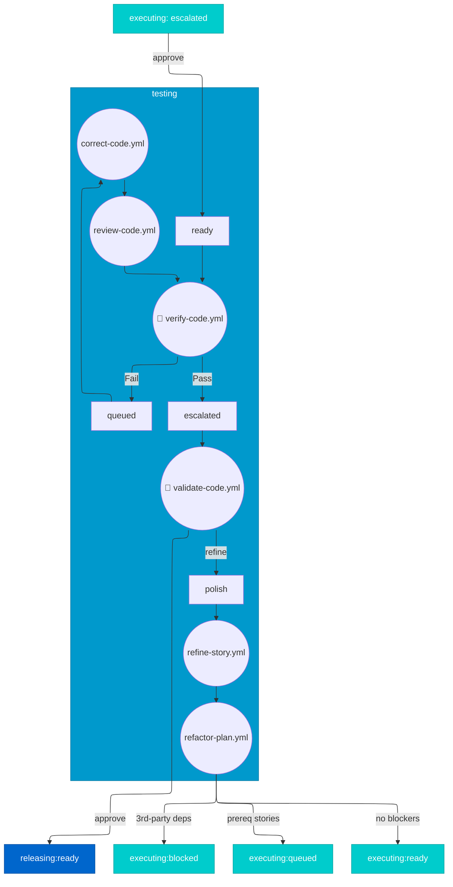

# Testing Stage - Option C: Streamlined Minimal

> For definitions of stages, statuses, and terminal states, see @workflow-three-field-model.md

**Design Philosophy**: Simplest possible flow with essential elements only. Easy to understand at a glance.

---

## Stage Diagram



---

## Workflow Description

### Entry from Executing

| Outcome from Executing | Entry State |
|------------------------|-------------|
| Human approves escalated implementation | `testing:ready` |

### Core Flow

```
Entry → verify-code.yml ──Pass──→ validate-code.yml ──approve──→ Exit
                            │                            │
                            Fail                         refine
                            ↓                            ↓
                          queued                       broken
                            │                            │
                            ├──→ fixed → retry           ├──→ fixed → retry
                            └──→ unfixable → escalated   └──→ unfixable → escalated
```

### Status Values

Three non-ready statuses used:

| Status | When Used |
|--------|-----------|
| `queued` | Verification fails (tests don't pass) |
| `broken` | Human validation requests refinement |
| `escalated` | Human approves OR queued/broken unfixable |

### Transitions

| From | To | Trigger |
|------|-----|---------|
| `ready` | `broken` | `verify-code.yml` fails |
| `ready` | `escalated` | `validate-code.yml` approves |
| `ready` | `broken` | `validate-code.yml` rejects |
| `broken` | `ready` | Issue fixed |
| `broken` | `escalated` | Issue unfixable (5 attempts) |

### Testing Steps

Two skills are invoked in sequence:

| Step | Skill | Actor | Question Answered |
|------|-------|-------|-------------------|
| 1 | `verify-code.yml` | 🤖 AI | Tests pass? Acceptance criteria met? |
| 2 | `validate-code.yml` | 👤 Human | Did I see it work? |

**Step 1: `verify-code.yml`** (AI Verification)
- Runs tests and checks acceptance criteria
- Verifies user journeys complete successfully
- Generates pass/fail report with evidence
- If pass → proceed to human validation
- If fail → `testing:broken`

**Step 2: `validate-code.yml`** (Human Validation)
- Presents demo scripts and checkpoint questions
- Human reviews evidence and decides
- If approved → `testing:escalated` → `releasing`
- If needs work → `testing:broken`

---

## What's Intentionally Omitted

This minimal design omits:

- **polish hold** — Refinements handled via broken→fixed loop
- **Explicit retry counts** — Delegated to debug-orchestrator
- **AI code review node** — Runs as part of `verify-code.yml`
- **Debug ladder details** — See @workflow-debugging.md
- **Evidence preparation** — Handled by `verify-code.yml` before `validate-code.yml`

### When to Use This Option

- Team prefers simple diagrams
- Debug ladder documented separately
- Orthogonal concerns handled by other docs
- Training/onboarding new team members

---

## Exit to Releasing

| Outcome | Transition |
|---------|------------|
| Human approves | → `releasing:ready` |
