# Releasing Stage

> For definitions of stages, statuses, and terminal states, see @workflow-three-field-model.md

---

## Stage Diagram

```mermaid
flowchart TB
    testing_approved[testing: approved] --> rel_queued

    subgraph releasing_stage [releasing]
        rel_queued[queued]
        check_children((🔍 gate-routing.yml<br/>children))
        validate_int((🔍 validate-integration.yml))
        rel_ready[ready]
        rel_broken[broken]
        rel_polish[polish]
        gen_docs([generate-docs.yml])
        ai_review([review-code.yml])
        rel_escalated[escalated]

        rel_queued --> check_children
        check_children -->|children pending| rel_queued
        check_children -->|all children at releasing:ready| validate_int
        validate_int -->|integration succeeds| rel_ready
        validate_int -->|integration fails| rel_broken
        rel_broken -->|fixed| rel_ready
        rel_ready --> gen_docs
        gen_docs --> ai_review
        ai_review --> rel_escalated
        rel_escalated --> human((👤 Human:<br/>Ready to ship?))
        human -->|refine| rel_polish
        rel_polish --> human
    end

    %% Define external nodes and edges from subgraph AFTER subgraph closes
    testing_ready[testing:ready]
    rel_broken -->|5 attempts fail| testing_ready
    human -->|approved| shipped[shipped]

    classDef testingBox fill:#0099CC,stroke:#007AA3,color:#fff
    classDef releasingBox fill:#0066CC,stroke:#0052A3,color:#fff
    classDef shippedBox fill:#0033CC,stroke:#0029A3,color:#fff
    classDef brokenBox fill:#FF6B6B,stroke:#CC5555,color:#fff
    classDef escalatedBox fill:#FFB84D,stroke:#CC9340,color:#fff
    classDef commandBox fill:#E0E0E0,stroke:#BDBDBD,color:#000
    class testing_approved testingBox
    class releasing_stage releasingBox
    class shipped shippedBox
    class rel_broken brokenBox
    class rel_escalated escalatedBox
    class gen_docs,ai_review commandBox
    class testing_ready testingBox
```

---

## Workflow Description

### Entry from Testing

Stories enter releasing after human approves testing:

| Outcome from Testing | Entry State |
|----------------------|-------------|
| Human approved | `releasing (queued)` |

### Status Transitions

| From | To | Trigger |
|------|-----|---------|
| `queued` | `ready` | `gate-routing children` passes, then `validate-integration` succeeds |
| `queued` | `broken` | `gate-routing children` passes, but `validate-integration` fails |
| `broken` | `ready` | Debug fixes integration issue |
| `broken` | `testing:ready` | 5 debug attempts fail — regresses to testing stage |
| `escalated` | `polish` | Human requests refinement |
| `polish` | `escalated` | Cleanup complete, returns to human review |
| `ready` | `escalated` | `generate-docs.yml` and `review-code.yml` complete |

### Phase 1: Child Wait and Integration Validation (queued)

Stories wait in `queued` until all child stories reach `releasing:ready`, then validate integration:

**Step 1: Gate Check** — `gate-routing.yml` (children gate type):
1. **Query children** — Find all child stories not at `releasing:ready` or `shipped`
2. **If pending** — Stay in `queued`, re-check on next heartbeat
3. **If all clear** — Proceed to integration validation

**Step 2: Integration Validation** — `validate-integration.yml`:
1. **Test integration** — Verify parent integrates correctly with child components
2. **If succeeds** — Transition to `ready`
3. **If fails** — Transition to `broken` for debugging
   - If fixed → `ready`
   - If 5 attempts fail → regress to `testing:ready`

### Phase 2: Documentation Generation (ready)

Once integration is validated, the `generate-docs.yml` skill generates or updates documentation:

1. **API documentation** — Generate from code/types
2. **Changelog entries** — From story description + linked commits
3. **README updates** — If public interfaces changed
4. **User-facing help** — If applicable to the story

### Phase 3: Cleanup Session (polish) — Optional

When human review identifies issues, the stakeholder can request refinement (`polish`):
- Code cleanup
- Knowledge transfer

When cleanup completes, the story returns to `escalated` for re-review.

### Phase 4: AI Review

Before final stakeholder sign-off, the `review-code.yml` command runs:

```mermaid
flowchart LR
    gen_docs([generate-docs.yml]) --> ai_review([review-code.yml])
    ai_review --> escalated[escalated]
    escalated --> human((👤 Stakeholder))
```

The AI review provides a final report for stakeholder decision-making, including documentation quality.

### Phase 5: Stakeholder Sign-off (escalated)

Final human checkpoint:

> **"Ready to ship?"**

The stakeholder reviews:
- AI review report
- Generated documentation
- Overall change summary
- Release readiness

| Decision | Transition |
|----------|------------|
| Approved | → `shipped` |
| Refine | → `releasing:polish` |
| Issues found | → `releasing:broken` |

### Debugging (broken hold)

> **Note:** Debugging is an orthogonal workflow. See @workflow-debugging.md for the full debug ladder.

---

## Statuses That Apply

| Status | When Used |
|--------|-----------|
| `ready` | Work can proceed (default) |
| `queued` | Waiting for children to reach `releasing:ready` |
| `broken` | Integration validation fails; exits to `ready` if fixed, or regresses to `testing` after 5 failures |
| `polish` | Human requests refinement |
| `escalated` | Awaiting stakeholder "Ready to ship?" sign-off |

---

## Exit to Shipped

| Outcome | Transition |
|---------|------------|
| Stakeholder approves ("Ready to ship?") | → `shipped` |
