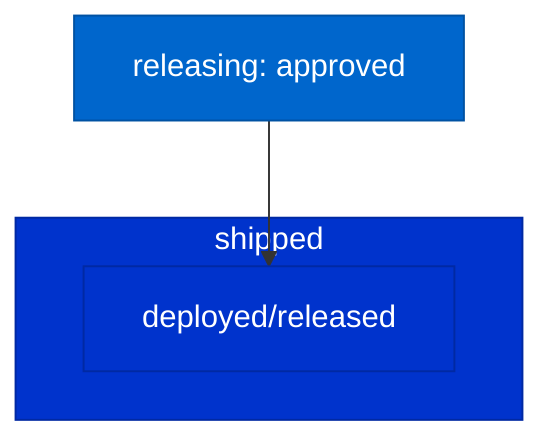

# Shipped Stage

> For definitions of stages, statuses, and terminal states, see @workflow-three-field-model.md

---

## Stage Diagram

---

## Workflow Description

### Terminal State

`shipped` is the terminal state of the story workflow. Stories reaching this stage have:

1. **Completed implementation** — All implementation work done
2. **Passed testing** — Human verified "Did I see it work?"
3. **Passed releasing** — Stakeholder approved "Ready to ship?"
4. **Been deployed** — Code is in production or released

### Entry from Releasing

| Outcome from Releasing | Entry State |
|------------------------|-------------|
| Stakeholder approved | `shipped` |

### No Further Transitions

Stories at `shipped` stage do not transition to other stages. They represent completed work.

---

## Statuses That Apply

None. `shipped` is a terminal state with no non-ready statuses.

---

## Post-Ship Activities

While `shipped` is terminal, the following may still occur:

| Activity | Handling |
|----------|----------|
| Bug discovered | Create new story at `concept` |
| Enhancement needed | Create new story at `concept` |
| Rollback required | Create new story at `concept` for rollback work |

The original shipped story remains at `shipped` as a historical record.
